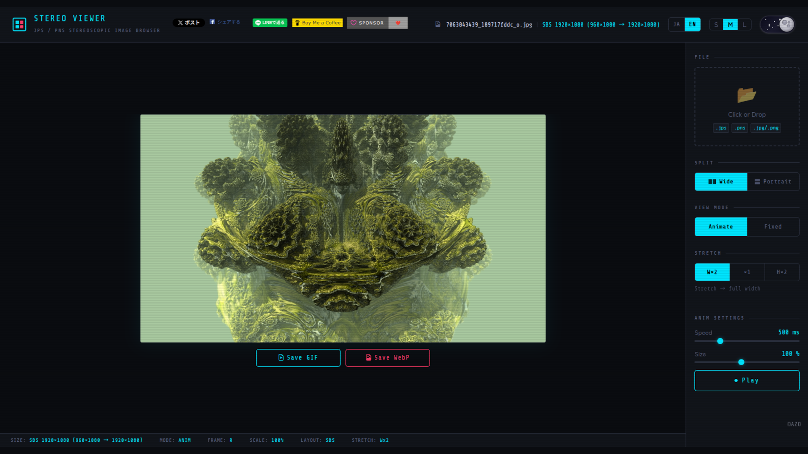

# STEREO VIEWER

[](https://github.com/AZO234/stereo-viewer/actions/workflows/deploy.yml)

**[🔗 Live Demo](https://azo234.github.io/stereo-viewer/)**

A web viewer for stereoscopic images (JPS/PNS) — Vue 3 + TypeScript + Bootstrap 5.



## Features

- **Animate mode** — crossfade left/right frames with adjustable speed
- **Fixed mode** — side-by-side display with swap toggle
- **Split method** — Wide (horizontal, SBS) / Portrait (vertical, O/U) toggle
- **Stretch mode** — W×2 / ×1 / H×2
- **Auto scale** — fits display within 960px (768px on mobile)
- **Export** — Save as animated GIF / animated WebP / PNG
- **Theme** — Dark / Light toggle
- **Font size** — S / M / L
- **Language** — JA / EN
- **PWA** — installable, offline support

## Supported Formats

| Extension | Description |
|-----------|-------------|
| `.jps`    | JPEG-based stereo image (Side-by-Side) |
| `.pns`    | PNG-based stereo image (Side-by-Side) |
| `.jpg` / `.png` | Standard Side-by-Side stereo images |

## Setup

```bash
pnpm install
pnpm run dev
```

## Build

```bash
pnpm run build     # production build → dist/
pnpm run typecheck # TypeScript check only (fast)
pnpm run preview   # preview build result
```

## CI/CD

### GitHub Pages

| File | `.github/workflows/deploy.yml` |
|------|-------------------------------|
| Trigger | Push to `main` / `master`, manual dispatch |
| URL | `https://<USER>.github.io/<REPO>/` |

**First-time setup:** Settings → Pages → Source → **GitHub Actions**

### GitLab Pages

| File | `.gitlab-ci.yml` |
|------|-----------------|
| Trigger | Push to `main` / `master` |
| URL | `https://<GROUP>.gitlab.io/<PROJECT>/` |

## Tech Stack

[](https://vuejs.org/)
[](https://www.typescriptlang.org/)
[](https://getbootstrap.com/)

- [Vue 3](https://vuejs.org/) + Composition API
- [TypeScript](https://www.typescriptlang.org/)
- [Vite](https://vitejs.dev/) + [vite-plugin-pwa](https://vite-pwa-org.netlify.app/)
- [Bootstrap 5](https://getbootstrap.com/) + Bootstrap Icons
- [gif.js](https://github.com/jnordberg/gif.js)

## License

MIT © AZO
